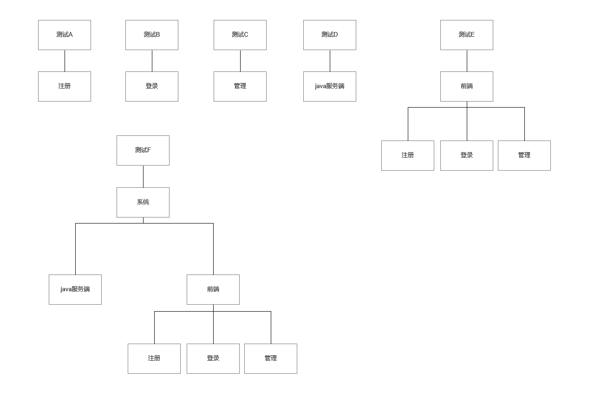
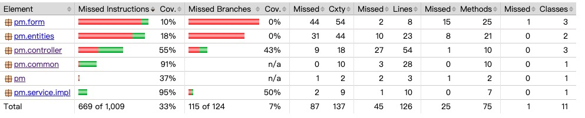

# 项目测试报告

## 非功能需求

### 观感需求

描述了对产品外观的期望、情绪和风格。  
登录界面采取简洁的窗口化和明确的功能，对于简单的需求直接展示。色调采取简洁冷色调配合商务用图。 

### 易用性需求与可执行需求

易用性会使产品提高符合用户习惯的能力以及其对使用的期望。它会对用户使用产品的生产效率、错误率以及用户对新产品的接收程度产生很大的影响。  简洁的登录页面符合易用性的需求。  

可执行需求是指产品可以在给定的时间或者特定的精确度来执行某些任务，或者在一段时间内的极端状态值。在考虑执行需求时，可以从完成任务的速度、结果的精确度、容量、允许值的范围、单位时间内完成的任务数、资源的使用效率、两次故障间的平均无故障时间、连续不停机时间等方面入手。

### 安全性需求

安全性指产品消除潜在风险的能力和对风险的承受能力。包含、保密性、可靠性和完整性三个子特性。保密性指的是数据不能被授权用户以外的任何人访问的能力。可靠性指的是授权用户可以不受阻止的访问数据、与其它软件的兼容的能力和产品的强壮度。完整性指的是安预期目标完成任务的能力。 账户和密码的安全可靠性保障此需求的完成。  

### 系统的完整性需求

指为完成业务需求和系统正常运行本身要求而必须具有的功能，包括联机帮助、数据管理、用户管理、软件发布管理、在线升级，等等。  

## 静态代码测试

### html

采用了w3c验证

### CSS

采用了w3c验证

### javascript

采用jsHint对代码进行静态测试

### java

采用Jtest基于 Eclipse 的插件对Java代码进行编码规范检查

## 单元与集成测试

采用自低向上的顺序进行单元集成测试

## CI/CD流水线

利用github actions构建以下 CI/CD 流水线：
1. build  
编译项目 -> 测试 -> 打包 -> 从dockerfile制作镜像 -> push到阿里云镜像仓库 -> 测试结果上传到Codecov
2. pull-docker  
ssh登录服务器 -> pull docker镜像 -> 运行

具体见CI/CD配置文件[maven.yml](https://github.com/ITProjectManagementTeam/ProjectManagement-backend/blob/master/.github/workflows/maven.yml)

### 测试

在 CI/CD 流水线上，Junit单元测试，jacoco统计覆盖率，然后将测试结果上传到[codecov](https://www.codecov.io/)

### 代码覆盖率

